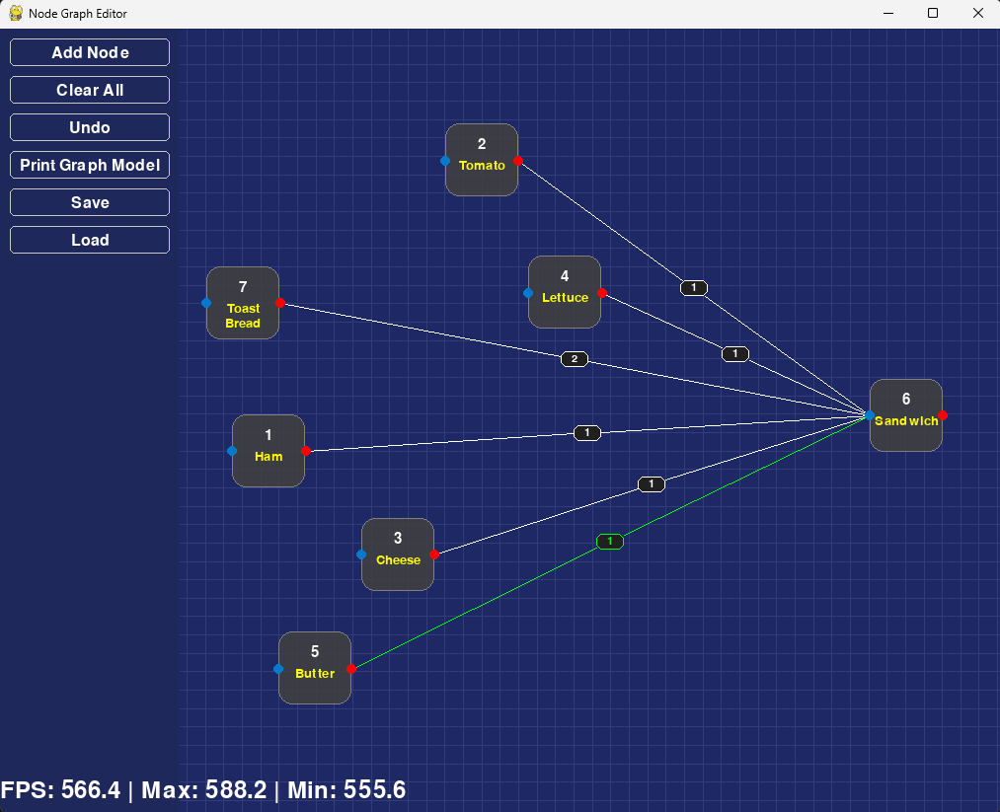

This is a pygame experiment to create node-graph based user interface.

 

### Setup

## Install UV package manager 
 (_Optional_) `winget search uv` 

 `winget install astral-sh.uv`

## Run environment setup inside the project directory

 `uv sync`

## Run tests

 `uv run pytest`

## Run linter

 `uv run ruff check .`

## Open the folder in VSCode and start coding.

